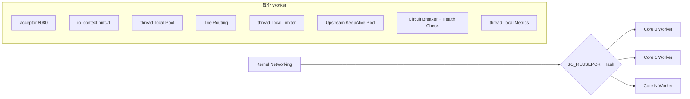

# 01. 系统概述与设计哲学

## 目标
- 面向 100k+ QPS 的高并发、低延迟 API 网关。
- 基于 C++20 协程与 Boost.Asio（Proactor）构建。
- 消除回调地狱与跨核锁竞争导致的性能损耗。

## 核心哲学
- Thread-Per-Core（Shared-Nothing）：每核独立闭环。
- 同步写法、异步执行：通过 `co_await` 描述 I/O。
- 无锁与局部性优先：thread_local + 内存池。
- 可观测与高可用内建：熔断、探活、Tracing、Metrics。

## 高层拓扑

## 非目标
- 不追求“任意线程共享状态 + 全局锁”编程模型。
- 不将控制面依赖与数据面强耦合。
- 不在热路径引入阻塞式系统调用。
