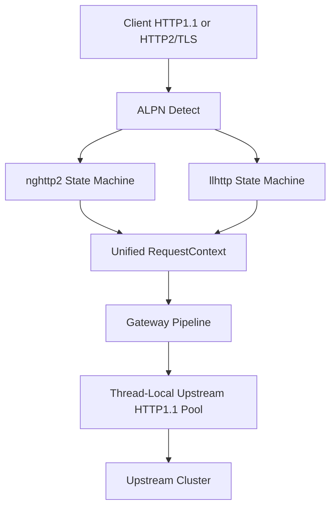

# 03. 内存管理与协议解析

## 3.1 Thread-Local 无锁内存池
- 每个 Core 初始化时预分配 Buffer 块（默认可按 8KB slab 规划）。
- 借用/归还均为 O(1) 指针操作，无需互斥锁与跨线程原子竞争。
- 使用 RAII `PooledBuffer` 管理生命周期，异常路径自动归还。

## 3.2 协议层职责
- 前端支持 HTTP/1.1 与 HTTP/2（TLS/ALPN）。
- 网关内核统一为 RequestContext，再转发到后端 HTTP/1.1。

## 3.3 HTTP/2 卸载（nghttp2）
- 处理多路复用 Stream 及帧级协议细节（SETTINGS/PING/WINDOW_UPDATE）。
- 上层业务不感知 HTTP/2 帧细节，只消费统一上下文。

## 3.4 HTTP/1.1 解析（llhttp）
- 基于状态机执行高速 Header/Chunked 解析。
- 与线程本地 Buffer 协同，减少额外拷贝。

## 3.5 协议转换拓扑

## 3.6 MUST 约束核对项
- MUST 采用 thread_local 资源池并保证借还路径无锁 O(1)。
- MUST 使用 RAII 管理缓冲生命周期，异常路径自动回收。
- MUST 通过统一 RequestContext 屏蔽协议实现差异。
- MUST 维持协议主栈：HTTP/2 使用 nghttp2，HTTP/1.1 使用 llhttp。
- MUST 避免多余数据拷贝，协议解析与本地缓冲协同工作。
