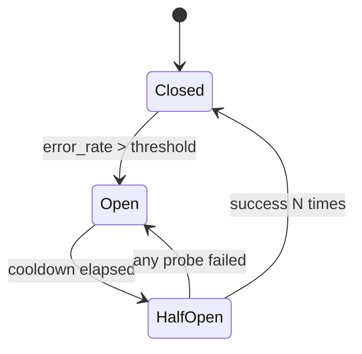

# 05. Upstream 连接池与高可用防护

## 5.1 Thread-Local Keep-Alive Pool
- 每个 Core 按 `Host:Port` 维护本地空闲连接队列。
- 借还无锁，避免跨线程同步。
- 默认策略：
1. Max Idle Timeout: 60s
2. Max Requests Per Connection: 10000

## 5.2 连接健康与剔除
- 复用前可进行非阻塞探测（如 peek）判断远端关闭。
- 失效连接立即销毁并重建，避免脏连接传播。

## 5.3 三态断路器（Closed/Open/Half-Open）
- Closed：正常放行。
- Open：快速失败并拒绝新请求。
- Half-Open：小流量探测恢复能力。

## 5.4 主动探活协程
- Closed 态低频探活（如 15s）。
- Open 态高频探活（如 2s）以缩短恢复时间。
- 探活结果驱动断路器状态迁移。

## 5.5 MUST 约束核对项
- MUST 将 Keep-Alive 连接池按核心本地化，借还路径无锁。
- MUST 在连接复用前进行健康校验，失效连接立即淘汰。
- MUST 使用 Closed/Open/Half-Open 三态断路器，不得退化为单阈值熔断。
- MUST 将探活结果与请求结果统一回写断路器状态机。
- MUST 在上游全不可用时快速失败并输出可观测 503/504 路径。
